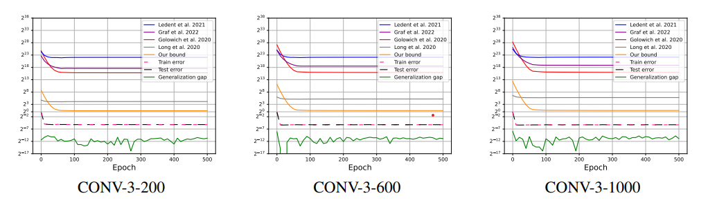

<h1 align="center">Norm-based Generalization Bounds for Compositionally Sparse Neural Networks</h1>
</h5>
<hr>

### Project Overview
The project investigates the role of architectural sparsity in convolutional networks and its impact on generalization performance.

### Key Contributions
- **Tighter Generalization Bounds**: Establishes significantly tighter norm-based generalization bounds for sparse neural networks (e.g., convolutional networks), improving upon previous bounds.
- **Insights into Architecture Sparsity**: Demonstrates the pivotal influence of sparsity in convolutional architectures on generalization.
- **Experimental Validation**: Provides empirical evidence showing the bounds' tightness and effectiveness in comparison to prior work.

## Requirements
- Python 3.10
- Pytorch 1.11
- Numpy
- Tqdm

## Running Experiments

### Key Files 

* conf/global_settings.py: Defines configuration parameters and hyperparameters for the network, including architecture choice, depth, width, weight decay (WD) and learning rate (LR). This file can be customized to experiment with various model and hyperparameter configurations.
* utils.py: Provides functions for saving experimental data, loading datasets, and pre-processing. Supports a range of datasets for training and evaluation. Includes implementations for evaluating our bound as well as other bounds from the literature for comparison purposes.
* models/: Contains implementations of neural network architectures used in experiments, with support for varying depth and width configurations.

### How to Run

1. **Edit Configuration**: Update the `conf/global_settings.py` file with your desired parameters (e.g., architecture, depth, learning rate).

2. **Run the Experiment**: Choose one of the following options:

   - **Option 1: Submit to Slurm**  
     Submit the experiment as a job to Slurm using the command:  
     ```bash
     sh train.sh
     ```

   - **Option 2: Run Directly**  
     Execute the training script directly using Python:  
     ```bash
     python train.py
     ```

<br />
<hr> 

### Example Experimental Results  
*(For more details, refer to the paper)*  



Figure 1: Figure 1: Comparison of our bound with prior bounds from the literature during training. The plots display our bound, train and test errors, the generalization gap, and prior bounds from the literature as training progresses. Each plot corresponds to a CONV-L-H network of depth $L$ with varying numbers of channels $H$.

### How to Reproduce Results

#### Training Setup
Use the following training configuration:
- **Batch size**: 32
- **Learning rate schedule**: Initial learning rate of 0.01, decayed three times by a factor of 0.1 at epochs 60, 120, and 160
- **Momentum**: 0.9
- **Weight decay**: 3e−3
- **Epochs**: 500
- **Loss function**: Mean Squared Error (MSE)
- **Weight normalization**: Applied to all trainable layers except the last layer, which remains un-normalized
- **Regularization parameter**: 3e-3
<hr> 
<h3> Citation </h3>

```bib
@article{galanti2024norm,
  title={Norm-based generalization bounds for sparse neural networks},
  author={Galanti, Tomer and Xu, Mengjia and Galanti, Liane and Poggio, Tomaso},
  journal={Advances in Neural Information Processing Systems},
  volume={36},
  year={2024}
}
```
